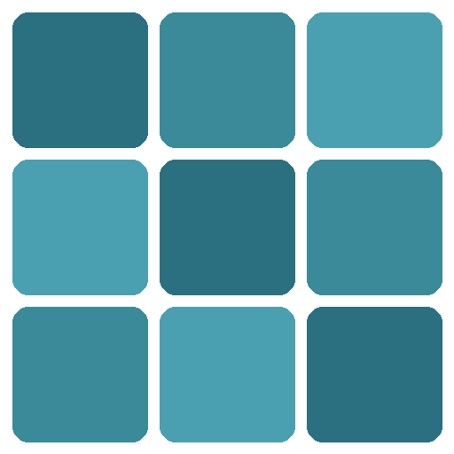
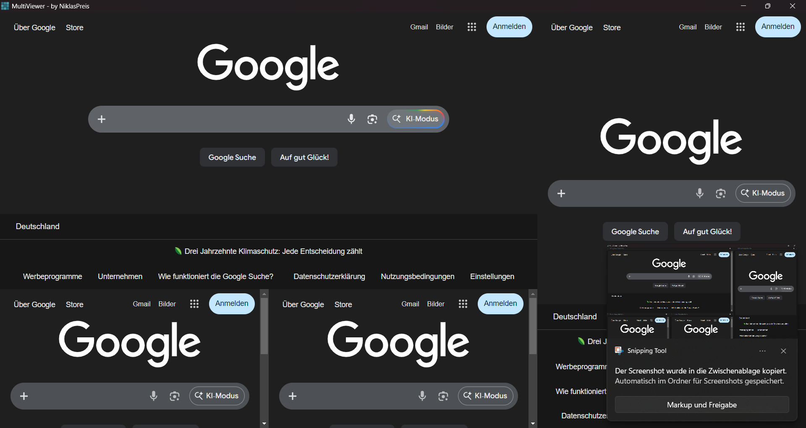
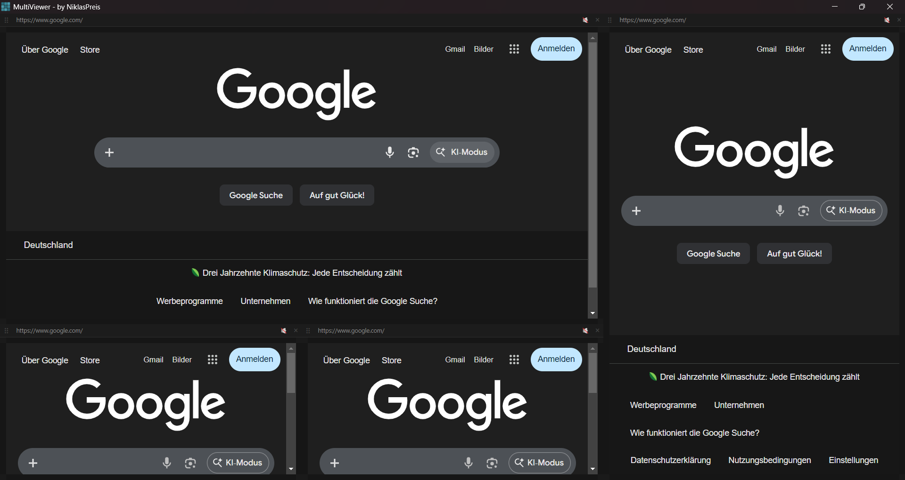
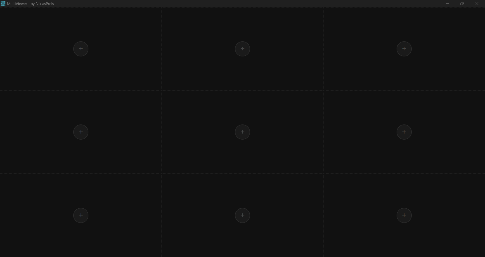
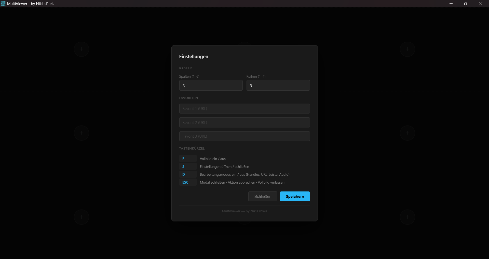

<div align="center">

#  MultiViewer

**A dark-themed multi-panel browser grid for Windows**

[](LICENSE)
[](#)
[](https://www.electronjs.org/)

Split your screen into a fully customizable grid of independent browser panels — each with its own Chromium session, URL bar, and isolated cookies.

</div>

---

## Screenshots

<div align="center">

| Preview | Edit Mode |
|:---:|:---:|
|  |  |

| Empty Grid | Settings |
|:---:|:---:|
|  |  |

</div>

---

## Features

- **Flexible grid** — configure any number of columns and rows in the settings
- **Independent sessions** — each panel has its own cookies, localStorage, and login state
- **Edit mode** — toggle handles on/off for a clean, borderless look (default: off)
- **Drag & drop** — rearrange panels freely within the grid
- **Resize from all sides** — drag any edge or corner handle to span multiple cells
- **Audio selection** — pick one panel as the sole audio source; all others are muted
- **URL prompt** — enter a URL or search term when opening each panel
- **Favourites** — save up to 3 URLs for quick access when opening a new panel
- **Fullscreen** — hide the taskbar and window frame instantly
- **Persistent settings** — grid size and favourites are saved between sessions
- **Autoplay support** — videos play without requiring a click (e.g. YouTube)
- **Chrome User-Agent** — avoids being blocked by sites that reject embedded browsers

---

## Quick Start

**Requirements:** [Node.js LTS](https://nodejs.org/)

Double-click **`app\run.bat`** — it installs Node.js automatically via winget if needed, then launches the app.

**Manual:**
```bash
cd app
npm install
npm start
```

---

## Keyboard Shortcuts

| Key | Action |
|:---:|---|
| `F` | Fullscreen on / off |
| `S` | Open / close settings |
| `D` | Edit mode on / off |
| `ESC` | Close modal · Cancel drag/resize · Exit fullscreen |

---

## How to use

| Action | How |
|---|---|
| Add a panel | Click **+** in any empty slot, enter a URL or search term |
| Open a favourite | Click **+**, then click one of the saved favourite buttons |
| Navigate | Press `D` to enter edit mode, click the URL bar, press Enter |
| Move a panel | Press `D`, drag the **⠿** handle to another slot |
| Resize a panel | Press `D`, drag any edge or corner handle |
| Select audio source | Press `D`, click **🔇** on a panel to make it the only audible source |
| Close a panel | Press `D`, click **×** |
| Change grid size | Press `S`, adjust columns/rows, click Save |
| Save favourites | Press `S`, enter up to 3 URLs, click Save |
| Reset to defaults | Press `S`, click **Reset to defaults**, confirm |

---

## Build a standalone EXE

Double-click **`app\build.bat`** — output lands in `builds\MultiViewer-win32-x64\`.

Zip the entire `MultiViewer-win32-x64` folder for distribution.

> Finished releases are published on the [Releases](https://github.com/NiklasPreis/MultiViewer/releases) page.

---

## Tech Stack

| | |
|---|---|
| [Electron](https://www.electronjs.org/) | Desktop shell |
| [electron-packager](https://github.com/electron/packager) | EXE builder |
| `BrowserView` | One isolated Chromium process per panel |

---

## Project Structure

```
MultiViewer/
├── README.md
├── LICENSE
├── app/
│   ├── main.js       # Main process — BrowserViews, IPC, settings
│   ├── renderer.js   # Overlay UI — edit mode, drag, resize, modals
│   ├── preload.js    # IPC bridge
│   ├── index.html    # Overlay shell, styles, modal HTML
│   ├── icon.ico      # App icon
│   ├── package.json
│   ├── run.bat       # One-click launch
│   └── build.bat     # One-click EXE build
└── builds/           # Local build output (not tracked by git)
```

---

## License

MIT © [NiklasPreis](https://github.com/NiklasPreis)
